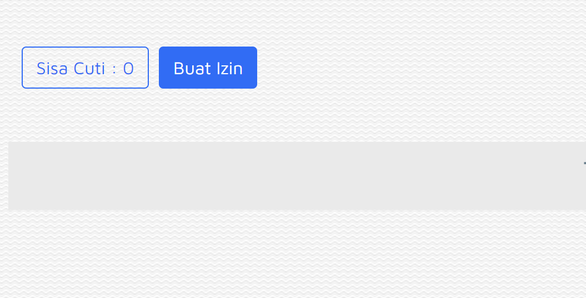

# Buat Izin Cuti

### 1. Membuat Perizinan&#x20;

.png>)

Untuk mengajukan izin, klik icon perizinan, lalu klik Buat Izin.

### 2. Pilih Kategori

.png>)

Lihat Kolom di bawah Kategori, kemudian Klik tanda panah bawah “v”, silahkan memilih alasan cuti:

\-  Cuti Melahirkan

\-  Cuti Tahunan

\-  Dinas Luar

\-  Fingerprint error

\-  Keluarga Meninggal

\-  Menikah

\-  Pulang Setengah Hari

\-  Sakit

\- Telat

\- WFH

Contoh jika perusahaan meminta karyawan untuk dinas luar, maka pilih dinas luar.

### 3. Pilih Tanggal Mulai Cuti

.png>)

Kemudian lihat kolom di bawah tulisan **Start**, pilih icon kalender, lalu pilih tanggal mulai cuti, contoh dipilihnya  tanggal mulai cuti adalah 17 Mei 2022.

### 4. Pilih Jam Mulai Cuti

.png>)

Pilih jam cuti, seperti di contoh dipilih jam 8:30

### 5. Pilih Tanggal Akhir Cuti

.png>)

Kemudian lihat kolom di bawah tulisan End, klik icon kalender, kemudian pilih tanggal akhir cuti, contoh dipilihnya  tanggal selesai cuti adalah 22 Mei 2022 .

### 6. Pilih Jam Akhir Cuti

Pilih jam akhir cuti, seperti di contoh ini, dipilih jam 17:30

### 7. Jumlah Hari Kerja yang Terpakai

.png>)

Di kolom Hari Kerja akan secara otomatis menghitung jumlah hari kerja (cuti) karyawan. Harap diperiksa kembali apakah jumlah hari kerja (cuti) tersebut sudah sesuai dengan pengajuan yang karyawan akan ajukan, perhatikan hari Sabtu, Minggu, libur tanggal merah.

Jika ada kesalahan dari jumlah hari atau sisa jumlah cuti, dapat cari info ke HRD.

### **8**. Masukkan Alasan Cuti

.png>)

Masukkan alasan cuti di kolom Alasan.

Contoh: jika kategori cuti adalah Dinas Luar, maka **WAJIB** menyertakan nomor surat beserta alasan.

### **9. Kirim**

.png>)

Berikutnya, klik **KIRIM.**
