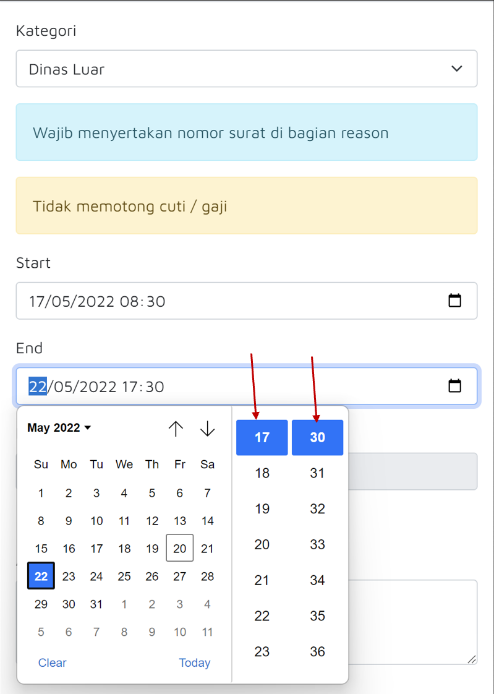

# Cek Riwayat Cuti

### 1. Klik Sisa Cuti

Klik tombol **Sisa Cuti**  untuk masuk ke halaman riwayat cuti.

### 2. Riwayat Cuti

.png>)

Bila sudah pernah mengambil cuti, maka akan muncul di halaman Riwayat Cuti. Bila belum, maka akan muncul **Belum ada riwayat cuti**.
