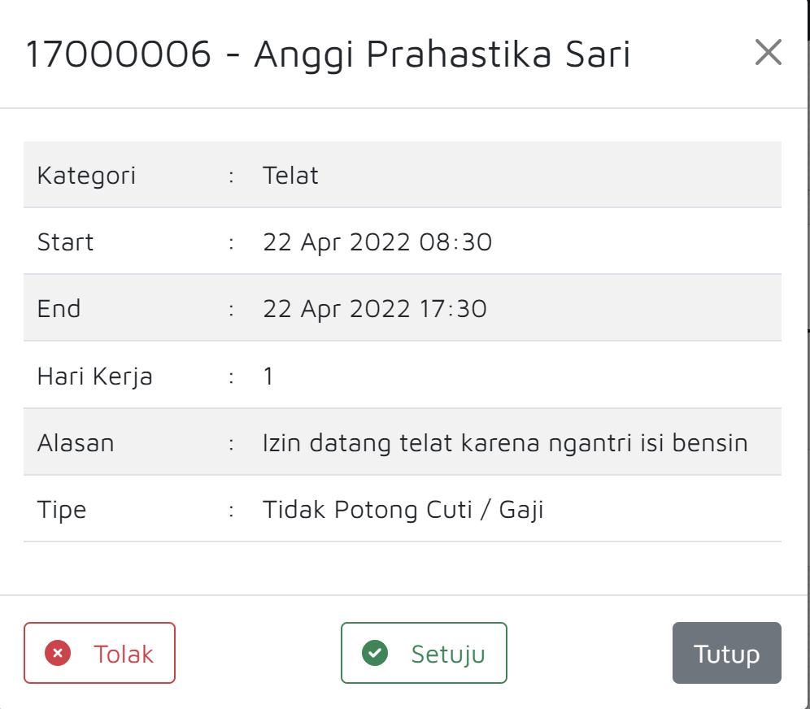

# Perizinan Tim

### Membuat Perizinan tim

Untuk posisi Junior Supervisor keatas, Anda akan memiliki pilihan **Perizinan (Team)**. Untuk melihat perizinan yang telah dibuat oleh team Anda, klik **Perizinan (Team).**

### Tanggapi Izin

Ketika **Perizinan (Team)** di klik, maka akan muncul halaman yang menunjukkan izin yang diminta oleh tim Anda. Untuk menanggapi, klik **Tanggapi izin.**

****

### Persetujuan

Ketika tombol **Tanggapi Izin** di klik, akan muncul deskripsi cuti. Mulai dari NIK, nama, kategori, mulai cuti, akhir cuti, jumlah hari kerja, alasan cuti, dan tipe cuti. Terdapat juga tombol Tolak, Setuju, dan Tutup. Bila Anda menyetujui cuti, klik Setuju, Bila tidak, klik Tolak.&#x20;
